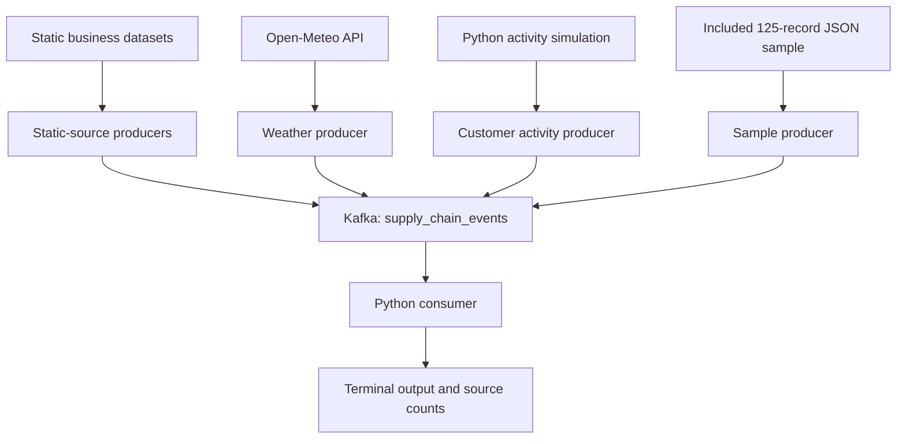

# Supply Chain Streaming Analytics

A Python and Apache Kafka project demonstrating a hybrid supply-chain data pipeline using static business datasets, live weather API data and simulated customer activity.

Developed for **Streaming Data Analytics — SDA-2** at **FORE School of Management**.

**Student:** Rishabh Verma  
**Current milestone:** Assignment 2 — Sample Data & Kafka Producer  
**Kafka topic:** `supply_chain_events`

---

## 1. Project Overview

Supply-chain analysis brings together information from multiple business functions, including orders, manufacturing, shipments, inventory and customer activity.

This project demonstrates how records from these sources can be converted into JSON events and published to a common Kafka topic.

The pipeline combines:

- **Static data replay:** Existing order, manufacturing, shipping, inventory and retail-sales records are streamed row by row.
- **Live API polling:** Weather data is fetched from Open-Meteo for selected reference locations.
- **Simulated real-time activity:** Python generates customer interactions using customer and product identifiers from Global Superstore.

A Python consumer reads events from Kafka, displays their contents and counts messages by source.

Assignment 2 focuses on ingestion and demonstrating successful message flow. Detailed cross-dataset reconciliation, stream processing and database integration are planned for later stages.

---

## 2. Quick Demonstration

The repository includes a compact JSON sample containing **50 records**:

| Source | Records |
|---|---:|
| Global Superstore orders | 25 |
| Manufacturing | 25 |
| Shipping and logistics | 25 |
| Inventory | 25 |
| Retail sales | 25 |
| **Total** | **125** |

The sample is stored at:

```text
data/assignment2_sample/supply_chain_sample.json
```

Run the demonstration using:

```bash
python sample_producer.py
```

This producer reads the included sample directly and does not require the full Excel or CSV datasets.

The 50-record file contains static-source events only. Live weather and generated customer activity have separate producers.

---

## 3. Pipeline Architecture



Kafka transports and stores the events. It does not automatically join orders, shipments and weather records.

Matching fields are included in the messages so that downstream processing can be added later.

---

## 4. Data Sources

| Source | Input type | Purpose | Source-system identifier |
|---|---|---|---|
| Global Superstore | Local Excel dataset | Order-item and customer/product information | `global_superstore` |
| Smart Manufacturing | Local Excel dataset | Material usage, energy consumption and production output | `smart_manufacturing` |
| E-commerce Shipping | Local Excel dataset | Shipment status and fulfilment information | `ecommerce_shipping` |
| Retail Inventory | Local CSV dataset | Stock quantities and inventory information | `retail_inventory` |
| Retail Sales | Local CSV dataset | Retail transaction information | `retail_sales` |
| Open-Meteo | HTTP API returning JSON | Current weather at reference locations | `open_meteo` |
| Customer Activity Simulator | Python-generated events | Simulated browsing and purchase-related activity | `python_customer_simulator` |

The static datasets have been enriched with identifiers, calculated fields and source metadata.

They remain independent datasets. Identifiers and relationships are preliminary and should not be interpreted as fully reconciled real-world supply-chain relationships.

---

## 5. Repository Contents

| File or folder | Purpose |
|---|---|
| `docker-compose.yml` | Defines Kafka, Zookeeper, Spark, MongoDB and MySQL services |
| `requirements.txt` | Python dependencies |
| `sample_producer.py` | Streams the included 50-record JSON sample |
| `producer.py` | Reads samples from the full local cleaned datasets |
| `producers/orders_producer.py` | Streams Global Superstore order records |
| `producers/manufacturing_producer.py` | Streams manufacturing records |
| `producers/logistics_producer.py` | Streams shipping records |
| `producers/inventory_producer.py` | Streams inventory records |
| `producers/retail_sales_producer.py` | Streams retail-sales records |
| `producers/weather_producer.py` | Polls Open-Meteo and publishes weather events |
| `producers/customer_activity_producer.py` | Generates and publishes simulated customer activity |
| `consumers/supply_chain_consumer.py` | Reads events and displays source-level counts |
| `scripts/create_assignment2_sample.py` | Builds the compact JSON sample from local cleaned datasets |
| `data/assignment2_sample/supply_chain_sample.json` | Included 50-record submission sample |
| `db/` | Database initialization files reserved for later work |
| `.gitignore` | Excludes environments, caches and large working datasets |

### Files not included in Git

Large source datasets, cleaned workbooks, generated working files and the Python virtual environment are excluded.

They are not required for the sample demonstration.

The full-data producers and the sample-generation script require the corresponding local datasets.

---

## 6. Technology Stack

- Python
- Apache Kafka
- Zookeeper
- Docker and Docker Compose
- `kafka-python`
- `pandas`
- `openpyxl`
- `requests`

The development environment used macOS and Python 3.14.

Spark, MongoDB and MySQL are retained in Docker Compose for later project stages. Assignment 2 does not yet implement Spark transformations or database-writing consumers.

---

## 7. Setup Instructions

### 7.1 Prerequisites

Install and start:

- Git
- Python 3
- Docker Desktop with Docker Compose

An internet connection is required to install dependencies, download Docker images and call Open-Meteo.

### 7.2 Clone the repository

```bash
git clone https://github.com/blaze2310/sda-supply-chain.git
cd sda-supply-chain
```

Run the commands below from this project directory.

### 7.3 Create a virtual environment

On macOS or Linux:

```bash
python3 -m venv venv
source venv/bin/activate
```

On Windows PowerShell:

```powershell
py -m venv venv
.\venv\Scripts\Activate.ps1
```

Install dependencies:

```bash
python -m pip install --upgrade pip
python -m pip install -r requirements.txt
```

Verify the imports:

```bash
python -c "from kafka import KafkaProducer, KafkaConsumer; import pandas, openpyxl, requests; print('Environment ready')"
```

### 7.4 Start Docker services

To start the complete development stack:

```bash
docker compose up -d
```

For only the services needed by the Kafka demonstration:

```bash
docker compose up -d zookeeper kafka
```

Check the containers:

```bash
docker compose ps
```

A container showing `Up` means its process is running. The Kafka commands below additionally check that the broker is responding.

If another project already uses the same host ports, stop the conflicting services or change the port configuration before starting this stack.

### 7.5 Create the Kafka topic

```bash
docker compose exec kafka kafka-topics.sh \
  --create \
  --if-not-exists \
  --topic supply_chain_events \
  --bootstrap-server localhost:9092 \
  --partitions 3 \
  --replication-factor 1
```

List the topics:

```bash
docker compose exec kafka kafka-topics.sh \
  --list \
  --bootstrap-server localhost:9092
```

Describe the project topic:

```bash
docker compose exec kafka kafka-topics.sh \
  --describe \
  --topic supply_chain_events \
  --bootstrap-server localhost:9092
```

The topic uses three partitions and one replica because this is a single-broker local demonstration.

---

## 8. Run the Assignment 2 Sample

Use two terminals.

### Terminal 1 — Consumer

Activate the virtual environment and run:

```bash
python consumers/supply_chain_consumer.py
```

Leave this terminal running.

### Terminal 2 — Sample producer

Activate the virtual environment and run:

```bash
python sample_producer.py
```

The sample producer:

1. Opens the included JSON sample.
2. Connects to `localhost:9092`.
3. Checks that the topic is available.
4. Serializes each event as UTF-8 JSON.
5. Sends the event to Kafka.
6. Waits for the broker acknowledgement.
7. Prints the source, entity, partition and offset.
8. Waits 0.5 seconds before sending the next event.

The expected completion message is:

```text
Completed successfully. 50 messages acknowledged by Kafka.
```

The producer then exits. The consumer remains running until stopped with `Control + C`.

### Important replay behaviour

Running the sample producer again sends another copy of all 50 events.

Existing Kafka messages are not automatically replaced or deduplicated.

---

## 9. Message Structure

All producers use a common outer structure:

```json
{
  "event_id": "MAIN-GSITEM-EVENT-000001",
  "event_type": "ORDER_ITEM_CREATED",
  "source_system": "global_superstore",
  "entity_id": "GSITEM-000001",
  "payload": {
    "order_item_id": "GSITEM-000001",
    "order_id": "GSORD-000001",
    "quantity": 3,
    "sales": 13.08
  }
}
```

The example payload is shortened for readability. The included sample retains the selected source records' fields.

| Field | Meaning |
|---|---|
| `event_id` | Identifier assigned to the event |
| `event_type` | Business event classification |
| `source_system` | Origin of the event |
| `entity_id` | Identifier of the relevant business entity or session |
| `payload` | Source-specific record fields |

### Event types

| Source | Event type |
|---|---|
| Orders | `ORDER_ITEM_CREATED` |
| Manufacturing | `MANUFACTURING_BATCH_RECORDED` |
| Logistics | `SHIPMENT_STATUS_RECORDED` |
| Inventory | `INVENTORY_STATUS_RECORDED` |
| Retail sales | `RETAIL_SALE_RECORDED` |
| Weather | `WEATHER_OBSERVED` |
| Customer activity | `CUSTOMER_ACTIVITY_RECORDED` |

---

## 10. Individual Static-Source Producers

These producers require the full cleaned datasets at the following paths:

```text
data/cleaned/orders/global_superstore_enriched.xlsx
data/cleaned/manufacturing/manufacturing_enriched.xlsx
data/cleaned/logistics/ecommerce_shipping_enriched.xlsx
data/cleaned/inventory/retail_inventory_enriched.csv
data/cleaned/inventory/retail_sales_enriched.csv
```

Run a source independently:

```bash
python producers/orders_producer.py
python producers/manufacturing_producer.py
python producers/logistics_producer.py
python producers/inventory_producer.py
python producers/retail_sales_producer.py
```

Alternatively, run the root producer to sample all five local sources:

```bash
python producer.py
```

The individual producers were initially tested with 30–35 records per source. The submission JSON contains 10 records per source.

Reading a complete file into Python does not mean the complete file is sent to Kafka: the configured sample limit controls how many records are published.

### Regenerate the submission sample

If the full local datasets are available:

```bash
python scripts/create_assignment2_sample.py
```

This regenerates the JSON file with 10 records per static source.

It does not send messages to Kafka or modify the source datasets.

---

## 11. Live Weather Producer

Run:

```bash
python producers/weather_producer.py
```

The weather producer requests current conditions from Open-Meteo and publishes one event for each of 18 configured market-region combinations.

It polls approximately every 60 seconds and continues until stopped with `Control + C`.

### Weather fields

- Market and region
- Reference city
- Latitude and longitude
- Temperature in degrees Celsius
- Relative humidity percentage
- Precipitation in millimetres
- Weather code
- Wind speed in kilometres per hour
- Wind direction in degrees

### Market-region identification

Names such as `Central` and `South` are ambiguous when used alone.

Weather events therefore include:

```text
market_clean + region_clean
```

For example:

```text
EU + Central
US + Central
LATAM + Central
```

These are separate combinations.

### Geographic limitation

The current implementation uses one manually selected reference city per market-region combination.

It retrieves weather at that coordinate—not an average or complete representation of the entire business region. The reference-city mapping is a demonstration assumption and has not been fully validated against every location in the source dataset.

The producer supplies matching fields; the current consumer does not perform a weather-to-orders join.

Current weather also must not be interpreted as the historical weather associated with old order dates.

### Polling versus weather updates

Repeated requests may return identical values. Polling every minute does not mean weather data changes every minute.

This producer streams model-based current conditions from Open-Meteo, not a direct physical sensor feed.

---

## 12. Simulated Customer Activity

Run:

```bash
python producers/customer_activity_producer.py
```

This producer requires:

```text
data/cleaned/orders/global_superstore_enriched.xlsx
```

It reads the existing customer and product IDs, then generates simulated activity approximately once per second.

Supported activity types include:

- `product_view`
- `search`
- `add_to_cart`
- `remove_from_cart`
- `checkout_started`
- `purchase`

Additional fields include:

- Session ID
- Customer ID
- Product ID
- Device type
- Traffic source
- Quantity
- Cart value

Generated events are also appended locally to:

```text
data/generated/customer_activity/customer_activity_events.jsonl
```

Stop the producer with `Control + C`.

### Simulation limitation

The events are synthetic, not observed customer behaviour.

Customer and product IDs come from the source dataset, but their pairing and activity details are generated. Cart values are simulated rather than calculated from a reconciled product-price master.

The current generator does not enforce a complete browsing-to-checkout sequence or maintain a consistent shopping cart.

---

## 13. Consumer Behaviour

The Python consumer:

- Subscribes to `supply_chain_events`.
- Deserializes JSON messages.
- Prints source, event type, entity and payload.
- Maintains source-level counts for the current process.
- Prints counts every five received messages.

It uses:

```text
Consumer group: supply-chain-assignment2
Offset reset: earliest
Automatic offset commits: enabled
```

`earliest` is used when the consumer group has no valid committed offset. Subsequent runs normally resume from the group's committed offsets instead of replaying everything.

Counts printed by the script are session counts, not permanent database totals.

### Console consumer alternative

To inspect messages with Kafka's built-in tool:

```bash
docker compose exec kafka kafka-console-consumer.sh \
  --bootstrap-server localhost:9092 \
  --topic supply_chain_events \
  --from-beginning
```

Press `Control + C` to stop.

With three partitions, Kafka preserves order within each partition, not one global order across all messages.

---

## 14. Troubleshooting

### Port already allocated

Another application or Docker project is using a required port.

Inspect running containers:

```bash
docker ps
```

Stop only the conflicting container or adjust the port configuration.

### Kafka connection failure

Check:

```bash
docker compose ps
docker compose logs --tail=50 kafka zookeeper
```

Confirm Docker is running and the broker is reachable at `localhost:9092`.

### File not found

The full local datasets are intentionally excluded from Git.

For a fresh clone, use:

```bash
python sample_producer.py
```

The other static producers require the local files listed earlier.

### Excel reports zero worksheets

An inventory workbook encountered an Excel-reader compatibility issue during development.

The affected retail files were exported through Excel as CSV UTF-8, and their producers were changed to use `pandas.read_csv()`.

Renaming an extension is not a format conversion.

### VS Code cannot resolve an import

Select the project interpreter using:

```text
Python: Select Interpreter
```

Choose the Python executable inside `venv`.

A successful syntax check does not verify imports or runtime connectivity.

### Consumer waits without printing

It may already have consumed the available messages.

Leave it running and start a producer in another terminal.

### Weather request failure

Check internet access and API availability. The current weather script exits on a request error; automatic retry and backoff are future improvements.

---

## 15. Scope and Limitations

This is a classroom streaming-ingestion prototype.

Current limitations include:

- Static datasets are replayed, not captured through change-data capture.
- Some cross-dataset identifiers are temporary.
- Inventory and retail products are not fully reconciled with Global Superstore products.
- Manufacturing-to-product mapping is not implemented.
- Weather uses reference-city proxies.
- Customer behaviour is simulated.
- Several producers reuse sequence-based identifiers across runs.
- Exactly-once delivery and deduplication are not implemented.
- A standardized event-time field and event-time joins are not implemented.
- Spark transformations and database sinks are not implemented.
- Durable storage and retention policies have not been hardened for production.

The Kafka configuration advertises `localhost:9092` for Python programs running on the host machine. A future Spark application running inside Docker will require suitable internal Kafka listener configuration.

---

## 16. Local Development Safety

The supplied Docker configuration is intended for local coursework only.

It includes development database credentials and exposed service ports. Do not deploy it unchanged on a public server.

Do not commit real credentials, API secrets or private datasets.

The virtual environment and large working datasets are excluded using `.gitignore`.

To stop the stack without intentionally removing containers:

```bash
docker compose stop
```

Avoid destructive volume-cleanup commands if stored project data is needed.

---

## 17. Assignment 2 Submission

The repository provides:

- A 50-record JSON sample
- A directly runnable sample producer
- A separate main producer for local cleaned datasets
- Individual static and live-source producers
- A Python consumer
- Dependency and Docker configuration files
- Setup and execution instructions

Producer and consumer terminal evidence, along with Docker screenshots, is supplied separately in the Assignment 2 GitHub issue.

The quickest faculty demonstration is:

```bash
python consumers/supply_chain_consumer.py
```

In another terminal:

```bash
python sample_producer.py
```

---

## 18. Future Development

Planned improvements include:

- Validating and standardizing cross-source relationships
- Building product, customer, warehouse and location master tables
- Replacing temporary shipment mappings
- Matching weather to verified destination locations
- Adding consistent event timestamps and unique identifiers
- Improving customer-session simulation
- Adding API retries and delivery-error handling
- Integrating Spark Structured Streaming
- Writing processed records to databases
- Building supply-chain monitoring and analytics

---

## 19. References and Attribution

- [SDA course material](https://aditya-dua.github.io/SDA/index.html)
- [Global Superstore dataset repository](https://github.com/sa-diq/Global_superstore_analytics)
- [Open-Meteo API documentation](https://open-meteo.com/en/docs)

The pipeline follows the producer/consumer concepts demonstrated in the course, adapted to supply-chain data.

Source datasets are third-party data. Enrichment fields and generated events are project additions; the underlying datasets are not claimed as original work.

AI assistance was used in developing and troubleshooting the implementation. Scripts were adapted and executed locally during project development.
