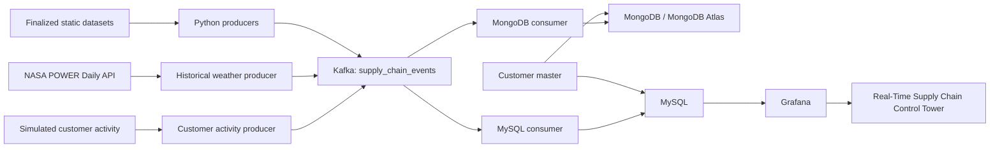

# Supply Chain Streaming Analytics — End-to-End Project

A complete supply-chain streaming analytics project built for **Streaming Data Analytics (SDA-2)** at **FORE School of Management**.

The project combines finalized business datasets, Python producers, Apache Kafka, MySQL, MongoDB / MongoDB Atlas, NASA POWER historical weather data, and Grafana dashboards to create an end-to-end supply-chain control-tower pipeline.

**Student:** Rishabh Verma  
**Kafka topic:** `supply_chain_events`  
**Primary analytics database:** `supply_chain_db`  
**Dashboard:** Grafana — *Real-Time Supply Chain Control Tower*

---

## 1. Business Problem

Supply-chain information is usually fragmented across orders, customers, inventory, manufacturing, logistics, retail sales and external conditions.

That fragmentation makes it difficult to identify risks early, understand operational bottlenecks, or connect customer demand with inventory and fulfilment.

This project addresses that problem by creating a common streaming architecture that:

1. standardizes finalized source datasets,
2. publishes source events to Kafka,
3. persists events into operational databases,
4. joins business entities through common identifiers, and
5. visualizes operational KPIs and risk indicators in Grafana.

The overall objective is **real-time end-to-end supply-chain visibility and risk monitoring**.

---

## 2. End-to-End Architecture


```mermaid
flowchart LR
    A["Finalized static datasets"] --> P["Python producers"]
    B["NASA POWER Daily API"] --> W["Historical weather producer"]
    C["Simulated customer activity"] --> CA["Customer activity producer"]

    P --> K["Kafka: supply_chain_events"]
    W --> K
    CA --> K

    K --> M["MongoDB consumer"]
    K --> S["MySQL consumer"]

    CM["Customer master"] --> MDB["MongoDB / MongoDB Atlas"]
    CM --> MYSQL["MySQL"]

    M --> MDB
    S --> MYSQL

    MYSQL --> G["Grafana"]
    G --> D["Real-Time Supply Chain Control Tower"]
```

### Current implementation

The implemented flow is:

```text
Finalized datasets / API
        ↓
Python producers
        ↓
Kafka — supply_chain_events
        ↓
Python persistence consumers
        ↓
MySQL + MongoDB / MongoDB Atlas
        ↓
SQL joins and business logic
        ↓
Grafana dashboard
        ↓
Supply-chain decisions
```

Spark remains available in Docker Compose for future stream-processing work, but it is **not required for the current dashboard pipeline**.

---

## 3. Final Data Sources

| Domain | Final source | Final records | Purpose |
|---|---|---:|---|
| Orders | `data/cleaned/orders/orders_cleaned.xlsx` | 51,290 | Order, customer, product, sales and profitability data |
| Customers | `data/cleaned/customer/customer_master.xlsx` | 1,590 | Customer master and customer-level aggregates |
| Inventory | `data/cleaned/inventory/retail_inventory_cleaned.xlsx` | 284,755 | Historical inventory snapshots |
| Retail sales | `data/cleaned/inventory/retail_sales_cleaned.xlsx` | 125,751 | Retail sales and returns |
| Manufacturing | `data/cleaned/manufacturing/manufacturing_cleaned.xlsx` | 10,000 | Production, defects, material and energy metrics |
| Logistics | `data/cleaned/logistics/logistics_cleaned.xlsx` | 10,999 | Shipment and fulfilment performance |
| Customer activity | `data/generated/customer_activity/customer_activity_events.jsonl` | 41 | Simulated activity tied to finalized identifiers |
| Weather | `data/api/weather/historical_weather_data.xlsx` | 21,376 | Historical weather aligned to order locations and dates |
| Weather location master | `data/api/weather/weather_location_master.xlsx` | 359 locations | Location reference for weather integration |

The repository includes the finalized datasets used by the current project. Archival `old/` folders were intentionally removed to avoid duplicate and obsolete versions.

---

## 4. Cross-Dataset Relationships

The final relationship model is:

```text
CUSTOMERS -- customer_id --> ORDERS

ORDERS -- order_item_id --> LOGISTICS

ORDERS -- product_id --> INVENTORY
ORDERS -- product_id --> RETAIL SALES
ORDERS -- product_id --> MANUFACTURING

ORDERS -- location_id --> WEATHER

ORDERS -- major business IDs --> CUSTOMER ACTIVITY
```

### Verified relationship coverage

- Customers ↔ Orders: all 1,590 customer IDs represented.
- Orders ↔ Logistics: 10,999 / 10,999 logistics rows match on `order_item_id`.
- Customer Activity ↔ Orders: all 41 generated events match across order/customer/product/location identifiers.
- Inventory, Retail Sales and Manufacturing each use 2,326 product IDs that are also present in Orders.
- Weather contains 359 finalized locations, matching all 359 order locations.

---

## 5. Kafka Streaming Layer

### Topic

```text
supply_chain_events
```

Configuration:

- Partitions: 3
- Replication factor: 1
- Local broker: `localhost:9092`

Static datasets are replayed as Kafka events through dedicated Python producers.

### Producers

```text
producers/orders_producer.py
producers/inventory_producer.py
producers/retail_sales_producer.py
producers/manufacturing_producer.py
producers/logistics_producer.py
producers/customer_activity_producer.py
producers/weather_producer.py
```

### Standard event envelope

```json
{
  "event_id": "unique-event-id",
  "event_type": "business-event-type",
  "source_system": "source-name",
  "entity_id": "business-entity-id",
  "event_timestamp": "timestamp",
  "payload": {
    "...": "source-specific fields"
  }
}
```

---

## 6. NASA POWER Historical Weather Integration

Historical weather is sourced from the **NASA POWER Daily Point API**.

API endpoint used by the producer:

```text
https://power.larc.nasa.gov/api/temporal/daily/point
```

The historical weather producer is:

```text
producers/weather_producer.py
```

It requests:

- `T2M` — mean temperature at 2 m
- `T2M_MAX` — maximum temperature
- `T2M_MIN` — minimum temperature
- `RH2M` — relative humidity
- `PRECTOTCORR` — corrected precipitation
- `WS10M` — mean wind speed
- `WS10M_MAX` — maximum wind speed

The producer derives exact `location_id + weather_date` requirements from finalized Orders data.

### Final validated weather coverage

- **21,376 records**
- **359 locations**
- Date range: **2022-01-01 to 2025-12-31**
- Event type: `WEATHER_HISTORICAL`
- Source system: `nasa_power`

### API key

**No NASA API key is required for the implementation used in this project.**

The producer sends normal HTTPS requests to the NASA POWER Daily Point endpoint with coordinates, dates and parameter names. There is therefore **no NASA API secret stored in the repository, environment file, or source code**.

The local download cache under:

```text
data/api/weather/nasa_power_cache/
```

is excluded from Git because the finalized weather workbook is already included.

---

## 7. Database Layer

The project uses two persistence paths.

### MySQL

Primary database:

```text
supply_chain_db
```

Final analytical tables:

1. `orders`
2. `customers`
3. `inventory`
4. `retail_sales`
5. `manufacturing`
6. `logistics`
7. `customer_activity`
8. `weather`

MySQL is the primary datasource for Grafana.

### MongoDB / MongoDB Atlas

MongoDB is retained as an additional persistence layer for the streaming domains and customer reference data.

The MongoDB consumer reads the Kafka topic and writes events into domain collections. MongoDB Atlas was also populated during project development.

Historical weather was intentionally kept in the MySQL analytics path for the Grafana implementation.

### Credentials

External credentials are **not hard-coded in the repository**.

For Atlas, `consumers/mongodb_consumer.py` reads:

```text
MONGO_URI
```

from the environment and otherwise defaults to local MongoDB.

Never commit production credentials, connection strings or API secrets.

---

## 8. Persistence Consumers

### MongoDB consumer

```text
consumers/mongodb_consumer.py
```

Responsibilities include:

- Kafka subscription
- JSON deserialization
- domain routing
- MongoDB writes
- duplicate-safe persistence logic

### MySQL consumer

```text
consumers/mysql_consumer.py
```

The current checked-in MySQL consumer is the dedicated historical-weather consumer. It uses the independent Kafka group:

```text
supply-chain-mysql-weather-historical
```

and writes only `WEATHER_HISTORICAL` events into MySQL.

This separation avoids changing the committed offsets of the previously finalized general MySQL ingestion flow.

---

## 9. Grafana — Real-Time Supply Chain Control Tower

Grafana connects directly to MySQL and provides the final analytics interface.

### Final dashboard sections

1. **Executive Overview**
2. **Customer & Demand**
3. **Sales & Orders**
4. **Inventory Health**
5. **Manufacturing**
6. **Logistics & Fulfilment**
7. **External Conditions**

### Dashboard filters

The dashboard supports:

```text
Financial Year | Market | Region | Country | Category | Product
```

The Financial Year variable follows the Indian financial year:

```text
1 April → 31 March
```

### Dashboard principles

Each panel is designed around:

```text
Business Question
        ↓
What the panel shows
        ↓
Decision / investigation supported
```

The dashboard uses time-series charts, KPI/stat panels, categorical comparisons, tables and maps.

---

## 10. Inventory Coverage

Inventory is a historical snapshot dataset rather than a single current-stock table.

Final inventory coverage:

```text
2025-06-01 → 2026-04-24
```

The inventory trend therefore uses the available inventory period directly rather than forcing the dashboard Financial Year variable onto a period where historical coverage does not exist.

---

## 11. Technology Stack

- Python
- Apache Kafka
- Zookeeper
- Docker / Docker Compose
- MySQL 8
- MongoDB
- MongoDB Atlas
- Grafana
- NASA POWER API
- pandas
- openpyxl
- kafka-python
- requests
- pymongo
- mysql-connector-python

Spark 3.5.6 is available in Docker Compose for future processing work.

---

## 12. Repository Structure

```text
sda-supply-chain/
│
├── consumers/
│   ├── mongodb_consumer.py
│   ├── mysql_consumer.py
│   └── supply_chain_consumer.py
│
├── producers/
│   ├── orders_producer.py
│   ├── inventory_producer.py
│   ├── retail_sales_producer.py
│   ├── manufacturing_producer.py
│   ├── logistics_producer.py
│   ├── customer_activity_producer.py
│   └── weather_producer.py
│
├── data/
│   ├── api/weather/
│   ├── assignment2_sample/
│   ├── cleaned/
│   │   ├── customer/
│   │   ├── inventory/
│   │   ├── logistics/
│   │   ├── manufacturing/
│   │   └── orders/
│   ├── generated/customer_activity/
│   └── raw/
│
├── db/
│   ├── mongo-init.js
│   └── mysql-init.sql
│
├── scripts/
├── docker-compose.yml
├── requirements.txt
└── README.md
```

Large local database dumps, BSON migration files, the Python virtual environment and temporary NASA cache files are intentionally excluded through `.gitignore`.

---

## 13. Setup

### Clone

```bash
git clone https://github.com/blaze2310/sda-supply-chain.git
cd sda-supply-chain
```

### Create a virtual environment

macOS / Linux:

```bash
python3 -m venv venv
source venv/bin/activate
```

Windows PowerShell:

```powershell
py -m venv venv
.\venv\Scripts\Activate.ps1
```

### Install dependencies

```bash
python -m pip install --upgrade pip
python -m pip install -r requirements.txt
```

### Start Docker services

```bash
docker compose up -d
```

Check:

```bash
docker compose ps
```

### Create Kafka topic if required

```bash
docker compose exec kafka kafka-topics.sh \
  --create \
  --if-not-exists \
  --topic supply_chain_events \
  --bootstrap-server localhost:9092 \
  --partitions 3 \
  --replication-factor 1
```

---

## 14. Running Producers

Static producers can be run independently:

```bash
python producers/orders_producer.py
python producers/inventory_producer.py
python producers/retail_sales_producer.py
python producers/manufacturing_producer.py
python producers/logistics_producer.py
```

Customer activity:

```bash
python producers/customer_activity_producer.py
```

Historical weather:

```bash
python producers/weather_producer.py
```

**Important:** the finalized static datasets have already been streamed during project development. Re-running full static producers will publish another copy of the events to Kafka unless the pipeline is intentionally being rebuilt.

---

## 15. Running Consumers

MongoDB:

```bash
python consumers/mongodb_consumer.py
```

Historical weather → MySQL:

```bash
python consumers/mysql_consumer.py
```

The historical-weather MySQL consumer intentionally ignores all other Kafka event types.

---

## 16. Validated Final Counts

| Dataset / table | Final count |
|---|---:|
| Orders | 51,290 |
| Customers | 1,590 |
| Inventory | 284,755 |
| Retail Sales | 125,751 |
| Manufacturing | 10,000 |
| Logistics | 10,999 |
| Customer Activity | 41 |
| Historical Weather | 21,376 |

Historical weather additionally validates:

- 359 distinct locations
- 21,376 unique `location_id + weather_date` pairs
- no missing temperature, humidity, precipitation or wind values in the finalized historical dataset

---

## 17. Data Safety and Repository Hygiene

The repository intentionally excludes:

- `venv/`
- `.env`
- Python caches
- MySQL dump files
- MongoDB BSON migration exports
- temporary NASA POWER cache files
- local logs

Do not commit:

- MongoDB Atlas credentials
- cloud-database credentials
- API secrets
- production passwords

The Docker credentials in `docker-compose.yml` are local coursework defaults and should not be used for any public deployment.

---

## 18. Project Status

### Implemented

- Finalized cross-dataset identifiers
- Full static-source producers
- Kafka topic and event flow
- Customer-activity generation
- Historical NASA POWER weather integration
- MongoDB persistence
- MongoDB Atlas persistence
- MySQL persistence
- Customer reference-table loading
- Verified cross-dataset relationships
- Grafana dashboard
- Financial Year and cascading business filters
- Supply-chain control-tower visualizations

### Optional / future work

- Spark / Flink processing layer
- cloud-hosted database for a permanently available public dashboard
- hardened secrets management
- production-grade infrastructure and observability

---

## 19. Dashboard Scope and Business Interpretation

The dashboard is an analytical classroom implementation. It should not be interpreted as a production supply-chain system.

Weather exposure analysis uses project-defined analytical bands for precipitation and wind. Those thresholds are **not NASA-defined disruption thresholds** and they do not establish causality between weather and shipment delay.

Customer activity is simulated rather than observed customer behaviour.

Static business datasets are replayed into Kafka to demonstrate streaming architecture.

---

## 20. References

- SDA course material: http://sda.adityadua.com/index.html
- NASA POWER: https://power.larc.nasa.gov/
- NASA POWER Daily API endpoint used in the project: https://power.larc.nasa.gov/api/temporal/daily/point
- Apache Kafka: https://kafka.apache.org/
- Grafana: https://grafana.com/
- MongoDB: https://www.mongodb.com/
- MySQL: https://www.mysql.com/

---

## 21. Academic Note

This repository was developed as a coursework and portfolio project.

Third-party datasets remain attributable to their original sources. Project-specific enrichment, cross-dataset identifiers, generated activity events, streaming logic, persistence logic, weather integration and dashboard design were developed as part of the project workflow.

AI assistance was used during development, debugging, validation and documentation.
